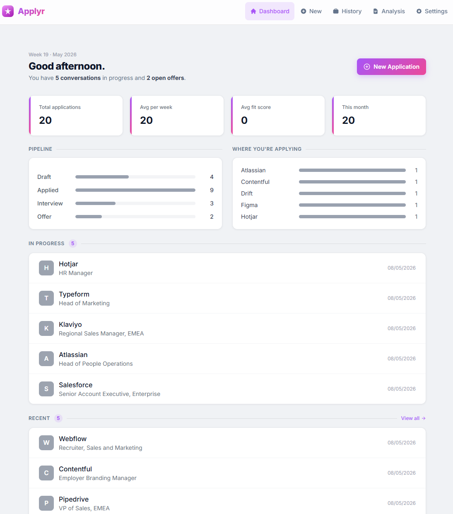

# Applyr



[](LICENSE)
[](https://hub.docker.com/r/larsmikki/applyr)
[](https://github.com/larsmikki/applyr/pkgs/container/applyr)
[](https://nodejs.org/)

**Applyr** is a self-hosted job application manager with AI-powered cover letter generation, fit scoring, and document management. Paste a job URL or description and let it do the heavy lifting — no accounts, no cloud, runs in a single Docker container.

## Features

- **Job extraction** — paste a URL or raw description and auto-extract company, role, and details
- **Fit analysis** — AI scores your CV against the job requirements (0–100) with a breakdown
- **Cover letter generation** — generates tailored cover letters with streaming output
- **Refinement** — iteratively improve any letter with natural language instructions
- **Gap analysis** — identifies skill and experience gaps between your CV and the job
- **Interview prep** — generates likely interview questions based on the job and your CV
- **CV rewrite** — rewrites your CV to better match a specific role
- **Document vault** — store CVs, cover letters, and portfolio documents (PDF, ODT, TXT, MD)
- **Snippet library** — reusable content blocks included in AI generation
- **Analytics** — pipeline charts, response rates, and trends over time
- **CSV export** — export your full application history
- **PIN protection** — optional PIN lock for privacy on shared machines
- **Multiple themes** — light and dark built-in themes
- **OpenAI-compatible** — works with GPT-4o, Ollama, Azure OpenAI, and any compatible API

## Getting started

Pick whichever install path matches your setup. All paths land on [http://localhost:3090](http://localhost:3090); open **Settings → AI Config** to add an OpenAI-compatible API key once it's running.

### 1. Docker (Docker Desktop, NAS, or any Docker server)

Works on Synology, Unraid, TrueNAS, QNAP, Proxmox, or a plain Docker host. Requires Docker (and ideally Docker Compose).

**One-liner:**

```bash
docker run -d \
  --name applyr \
  -p 3090:3090 \
  -v applyr-data:/app/data \
  -v applyr-output:/app/output \
  --restart unless-stopped \
  larsmikki/applyr:latest
```

**Docker Compose (recommended):**

```yaml
services:
  applyr:
    image: larsmikki/applyr:latest
    container_name: applyr
    ports:
      - "3090:3090"
    volumes:
      - applyr-data:/app/data
      - applyr-output:/app/output
    restart: unless-stopped

volumes:
  applyr-data:
  applyr-output:
```

The `output` volume is where generated cover letters and documents are saved. Bind-mount it to a host folder if you'd rather see the files directly:

```yaml
volumes:
  - applyr-data:/app/data
  - /volume1/docs/Applyr:/app/output   # NAS example
```

On Docker Desktop, the app will be reachable at [http://localhost:3090](http://localhost:3090). On a NAS, swap `localhost` for the NAS IP.

### 2. Local install on Windows

Requires [Git for Windows](https://git-scm.com/download/win) and [Node.js 20+](https://nodejs.org/) (LTS). PowerShell or Windows Terminal works.

```powershell
git clone https://github.com/larsmikki/applyr.git
cd applyr
npm run setup
npm run dev
```

Open [http://localhost:3090](http://localhost:3090). Data is written to `%USERPROFILE%\.applyr\data\` in production builds and to `.\data\` in dev.

For a production build:

```powershell
npm run build
npm start
```

### 3. Local install on macOS

Requires [Homebrew](https://brew.sh/) (optional but easiest) and Node.js 20+.

```bash
brew install node git           # skip if already installed
git clone https://github.com/larsmikki/applyr.git
cd applyr
npm run setup
npm run dev
```

Open [http://localhost:3090](http://localhost:3090). For a production build:

```bash
npm run build
npm start
```

Data lives at `~/.applyr/data/` in production and `./data/` in dev.

### 4. Local install on Linux

Requires Node.js 20+ and Git. On Debian/Ubuntu:

```bash
# Node 20 via NodeSource
curl -fsSL https://deb.nodesource.com/setup_20.x | sudo -E bash -
sudo apt-get install -y nodejs git

git clone https://github.com/larsmikki/applyr.git
cd applyr
npm run setup
npm run dev
```

On Fedora/RHEL use `dnf install nodejs git`; on Arch use `pacman -S nodejs npm git`.

Open [http://localhost:3090](http://localhost:3090). For a production build:

```bash
npm run build
npm start
```

To run as a background service, drop a unit file in `/etc/systemd/system/applyr.service` pointing `ExecStart` at `npm start` from the repo root.

## Configuration

| Variable | Default | Description |
|----------|---------|-------------|
| `PORT` | `3090` | Port the server listens on |
| `DATA_DIR` | `/app/data` | Directory for the SQLite database and vault |
| `OUTPUT_DIR` | `/app/output` | Directory for generated output documents |

AI model and API key are configured inside the app at **Settings → AI Config**.

## Usage

| Action | How |
|--------|-----|
| Add an application | Click **New Application**, paste a URL or description |
| Run fit analysis | Open an application → **Analyze Fit** |
| Generate cover letter | Open an application → **Generate Letter** |
| Refine a letter | Open a generated letter → **Refine** |
| Manage documents | **Vault** in the navigation |
| View pipeline stats | **Analytics** in the navigation |
| Export applications | **Settings → Export CSV** |
| Change theme | **Settings → Themes** |

## Data

All data is stored inside the Docker volumes:

```
/app/data/
  applyr.db      # applications, settings, snippets
  vault/         # uploaded documents

/app/output/
  *.pdf / *.odt  # generated cover letters and documents
```

## License

[MIT](LICENSE)

## Support

If Applyr saves you time, consider [buying me a coffee](https://buymeacoffee.com/larsmikki) or [donating via PayPal](https://paypal.me/larsmikki). It helps keep the project free and maintained.
